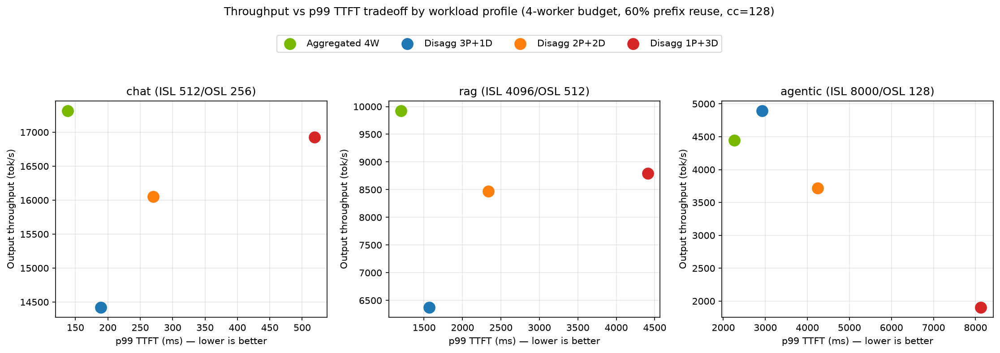
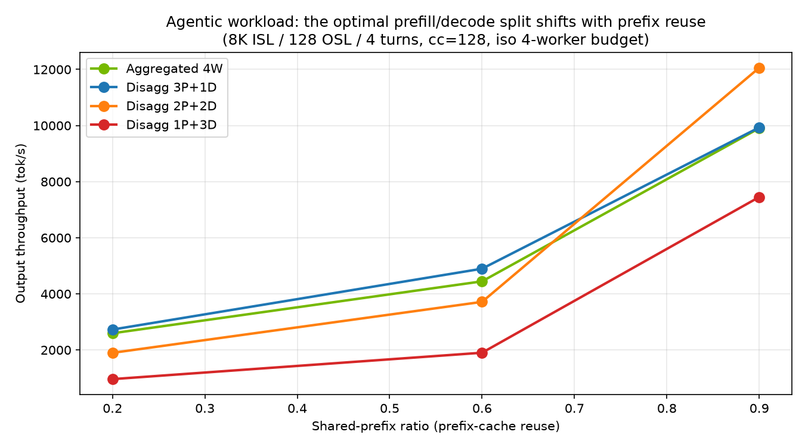
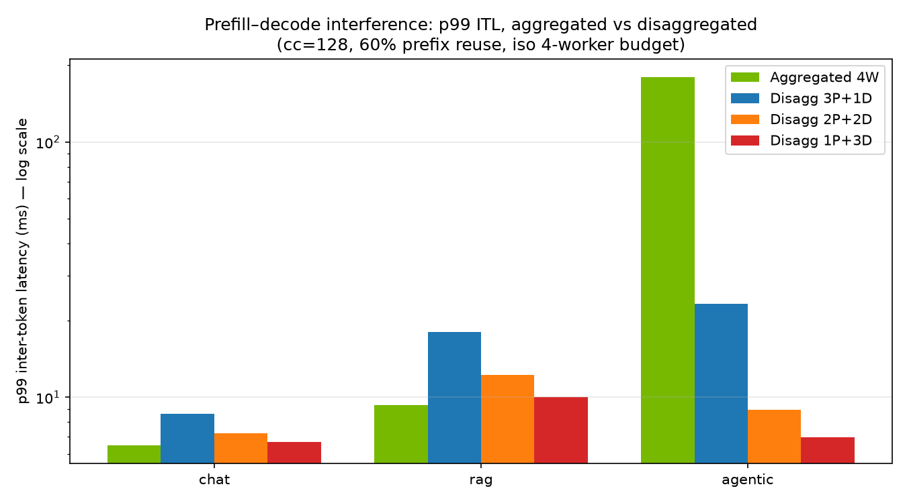

# When Does Disaggregation Pay? A DynoSim Study of Agentic vs. Chat Workloads
 
**A simulation study of aggregated vs. disaggregated prefill/decode serving under an
iso-GPU budget, using [NVIDIA Dynamo's DynoSim](https://docs.nvidia.com/dynamo/user-guides/dynosim)
simulation stack.**
 
> ⚠️ **Honest framing:** These are discrete-event simulation results using DynoSim's mocker
> engine with **default timing models — not AIC-calibrated GPU timing and not hardware
> benchmarks**. The relative behavior across configurations is the finding; the absolute
> numbers are not. Per NVIDIA's own guidance, DynoSim "narrows the search space; it does not
> replace real-hardware validation."
 
## Research question
 
At what workload shape (ISL/OSL mix, prefix-reuse rate, load level) does disaggregated
prefill/decode serving beat aggregated serving under the **same worker budget** — and where
does the crossover sit for **agentic** traffic specifically?
 
## Experiment design
 
108 DynoSim offline runs (`python -m dynamo.replay` via the Python API), full factorial:
 
| Dimension | Values |
|---|---|
| Workload profile | chat (ISL 512 / OSL 256 / 3 turns), RAG (4096 / 512 / 1 turn), agentic (8000 / 128 / 4 turns) |
| Worker split (4-worker budget) | Aggregated 4W · 3P+1D · 2P+2D · 1P+3D |
| Shared-prefix ratio | 0.2 · 0.6 · 0.9 |
| Replay concurrency | 8 · 32 · 128 |
 
Constants: 200 sessions, KV router, 8 prefix groups, 250 ms inter-turn delay, block size 64.
 
## Findings
 
**1. For chat traffic, aggregated wins everywhere.** Across every prefix ratio and load
level, aggregated 4W beats every disaggregated split on *both* throughput and p99 TTFT.
With short prompts, splitting the worker pool just strands capacity.
 
**2. For agentic traffic, disaggregation wins on throughput — and the optimal
prefill/decode ratio shifts with prefix-cache reuse.** At low reuse (0.2) the workload is
prefill-bound and 3P+1D wins. As reuse rises, cached prefixes shrink prefill work and the
winner migrates toward decode-heavy splits — at 0.9 reuse and high load, 2P+2D delivers
**12,069 tok/s vs. 9,719 tok/s aggregated (+24%)**. The right P:D ratio is a *function of
your prefix hit rate* — which is exactly why dynamic disaggregation and planner-driven
scaling exist.
 
**3. The universal tradeoff is TTFT vs. ITL stability.** Aggregated wins p99 TTFT in
*every* cell. But it pays in prefill–decode interference: at cc=128 aggregated p99 ITL is
**88–184 ms** across profiles, while every disaggregated split holds p99 ITL at **7–9 ms**
(~20x steadier). For multi-turn agents, where a user watches tokens stream on every one of
many turns, ITL stability *is* the experience.
 



 
## Reproducibility
 
The full 108-run sweep was executed independently on two environments — an x86_64 Ubuntu 24
container and an arm64 Linux container (Docker on Apple Silicon) — completing in ~20–25 s
on CPU with 0 failures on both. Headline results matched within noise (e.g., agentic
1P+3D @ 0.9 prefix / cc=128: 7,446 vs. 7,452 tok/s; p99 ITL 7.1 ms on both).
 
## Reproduce
 
**Requires Linux** (`ai-dynamo-runtime` ships Linux-only wheels — no macOS or Windows builds).
 
On any Linux machine or Google Colab:
 
```bash
pip install ai-dynamo pandas matplotlib
RUST_LOG=off python3 sweep.py      # ~25s on CPU, no GPU required
python3 plots.py
```
 
On **macOS (Apple Silicon)**, use Docker with an explicit ARM platform flag:
 
```bash
docker run --rm -it --platform linux/arm64 -v "$PWD":/work -w /work python:3.12-slim bash -c \
  "pip install ai-dynamo pandas matplotlib && RUST_LOG=off python3 sweep.py && python3 plots.py"
```
 
## First-user notes (ai-dynamo 1.2.1 pip release, July 2026)
 
Things the docs don't tell you, found the hard way:
 
1. **Disaggregated replay requires `worker_type` inside the engine args.** Passing
   `--num-prefill-workers/--num-decode-workers` alone raises
   `only used for disagg replay`; you must also pass
   `--prefill-engine-args '{"worker_type":"prefill", ...}'` and
   `--decode-engine-args '{"worker_type":"decode", ...}'`. Only the error messages
   reveal this, one field at a time.
2. **Trace-format naming drift between main and the pip release**: main-branch docs
   describe `agentic_mooncake`; the released CLI exposes `applied_compute_agentic`.
3. **(Python API)** `run_synthetic_trace_replay` takes `MockEngineArgs` objects, not
   dicts — build them with `MockEngineArgs.from_json(json.dumps({...}))` as the CLI does
   internally.
4. **Apple Silicon:** there are no macOS wheels, so use Docker — and pass
   `--platform linux/arm64` explicitly. The arm64 Linux wheels work perfectly
   (this study's sweep: 108/108 in ~20 s). Under amd64 *emulation* (Rosetta),
   single CLI replays complete, but this sweep — looped in-process calls via the
   Python API — segfaults at engine init regardless of VM memory or workload
   size. Beware Docker's cache trap: if an amd64 image was ever pulled, it is
   silently reused even without a platform flag (the tell is a
   `WARNING: image's platform does not match` line). Details:
   [ai-dynamo/dynamo#11228](https://github.com/ai-dynamo/dynamo/issues/11228).
## Limitations & next steps
 
- Default mocker timing (no `--aic-*` calibration) — next fidelity step is AIC-backed
  timing for a supported model/GPU tuple.
- Offline replay only; a live Mocker deployment (real frontend/router/KV-event paths)
  is the natural validation step.
- Planned follow-up: the same workload matrix on **llm-d** for an architecture-level
  comparison of the two disaggregation stacks.
## Author
 
Saurabh Rai — AI infrastructure solution architecture.
GitHub: [saurabh9498](https://github.com/saurabh9498) ·
