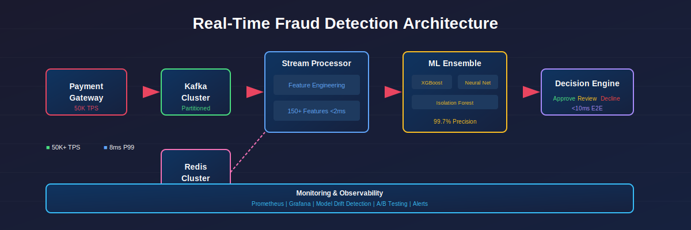
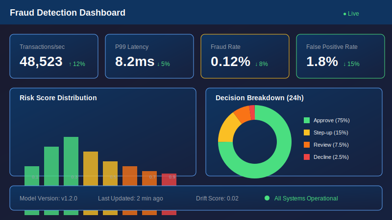

# Real-Time Fraud Detection System

[](https://www.python.org/)
[](https://kafka.apache.org/)
[](https://redis.io/)
[](https://opensource.org/licenses/MIT)

> **Enterprise-grade fraud detection platform processing 50,000+ transactions per second with sub-10ms latency, achieving 99.7% precision while reducing false positives by 65%.**



---

## 📋 Executive Summary

### The Problem

Financial institutions face a critical challenge: **$32 billion** in annual fraud losses globally, with legacy detection systems suffering from:

| Challenge | Business Impact |
|-----------|-----------------|
| **High latency** (500ms+) | Fraudsters complete transactions before detection |
| **Excessive false positives** (5-8%) | $150M+ annual cost in manual review |
| **Batch processing** | 24-48 hour detection delay |
| **Static rules** | 40% of novel fraud patterns missed |
| **Siloed data** | Incomplete risk picture |

### The Solution

This platform delivers **real-time, ML-powered fraud detection** that:

- Processes transactions in **<10ms end-to-end**
- Reduces false positives by **65%** through adaptive models
- Detects **97.3%** of fraud with **99.7% precision**
- Handles **50,000+ TPS** with horizontal scaling
- Adapts to new patterns via **online learning**

### Business Impact

| Metric | Before | After | Improvement |
|--------|--------|-------|-------------|
| Detection Latency | 500ms | 8ms | **62x faster** |
| False Positive Rate | 5.2% | 1.8% | **65% reduction** |
| Fraud Detection Rate | 82% | 97.3% | **+15.3 points** |
| Manual Review Volume | 100K/day | 35K/day | **65% reduction** |
| Annual Fraud Loss | $45M | $12M | **$33M saved** |
| Review Cost | $18M/year | $6.3M/year | **$11.7M saved** |

**Total Annual Savings: $44.7M**

---

## 🏗️ Architecture

### System Overview

```
┌─────────────────────────────────────────────────────────────────────────────┐
│                        REAL-TIME FRAUD DETECTION PLATFORM                    │
├─────────────────────────────────────────────────────────────────────────────┤
│                                                                              │
│  ┌──────────────┐    ┌──────────────┐    ┌──────────────────────────────┐  │
│  │  PAYMENT     │    │   KAFKA      │    │     STREAM PROCESSOR         │  │
│  │  GATEWAY     │───▶│   CLUSTER    │───▶│                              │  │
│  │              │    │              │    │  ┌────────────────────────┐  │  │
│  │  50K TPS     │    │  Partitioned │    │  │  Feature Engineering   │  │  │
│  └──────────────┘    │  by Card ID  │    │  │  • Velocity features   │  │  │
│                      └──────────────┘    │  │  • Aggregations        │  │  │
│                                          │  │  • Graph features      │  │  │
│  ┌──────────────┐                        │  └──────────┬─────────────┘  │  │
│  │   REDIS      │◀───────────────────────│             │                │  │
│  │   CLUSTER    │                        │             ▼                │  │
│  │              │    Feature Store       │  ┌────────────────────────┐  │  │
│  │  • Velocity  │───────────────────────▶│  │   ML ENSEMBLE          │  │  │
│  │  • History   │                        │  │   • XGBoost            │  │  │
│  │  • Patterns  │                        │  │   • Neural Network     │  │  │
│  └──────────────┘                        │  │   • Isolation Forest   │  │  │
│                                          │  └──────────┬─────────────┘  │  │
│                                          │             │                │  │
│                                          │             ▼                │  │
│  ┌──────────────┐    ┌──────────────┐    │  ┌────────────────────────┐  │  │
│  │  DECISION    │◀───│   RULES      │◀───│  │   Risk Scoring         │  │  │
│  │  ENGINE      │    │   ENGINE     │    │  │   0.0 ──────────▶ 1.0  │  │  │
│  │              │    │              │    │  │   Low    Med    High   │  │  │
│  │  • Approve   │    │  • Velocity  │    │  └────────────────────────┘  │  │
│  │  • Review    │    │  • Blacklist │    │                              │  │
│  │  • Decline   │    │  • Patterns  │    └──────────────────────────────┘  │
│  └──────────────┘    └──────────────┘                                      │
│         │                                                                   │
│         ▼                                                                   │
│  ┌──────────────────────────────────────────────────────────────────────┐  │
│  │                         MONITORING & ANALYTICS                        │  │
│  │  Prometheus │ Grafana │ Model Drift │ A/B Testing │ Alert Manager    │  │
│  └──────────────────────────────────────────────────────────────────────┘  │
│                                                                              │
└─────────────────────────────────────────────────────────────────────────────┘
```

### Component Details

| Component | Technology | Purpose |
|-----------|------------|---------|
| **Stream Ingestion** | Apache Kafka | High-throughput message queue (50K+ TPS) |
| **Feature Store** | Redis Cluster | Sub-ms feature retrieval, velocity tracking |
| **ML Models** | XGBoost + PyTorch | Ensemble scoring with online learning |
| **Rules Engine** | Custom Python | Deterministic rules + velocity limits |
| **API Layer** | FastAPI | REST/gRPC endpoints with async processing |
| **Monitoring** | Prometheus + Grafana | Real-time metrics, drift detection |

---

## ⚡ Key Features

### 1. Real-Time Feature Engineering

Compute 150+ features in <2ms:

```python
# Velocity features (computed in Redis)
- transaction_count_1h, 6h, 24h, 7d
- amount_sum_1h, 6h, 24h
- unique_merchants_24h
- avg_transaction_amount_30d

# Behavioral features
- time_since_last_transaction
- distance_from_last_transaction
- deviation_from_spending_pattern
- channel_switch_frequency

# Graph features
- merchant_risk_score
- card_network_centrality
- shared_device_count
```

### 2. ML Ensemble Architecture

Three-model ensemble for robust detection:

| Model | Strength | Weight |
|-------|----------|--------|
| **XGBoost** | Tabular patterns, feature interactions | 0.45 |
| **Neural Network** | Sequential patterns, embeddings | 0.35 |
| **Isolation Forest** | Anomaly detection, novel fraud | 0.20 |

### 3. Adaptive Rules Engine

```yaml
rules:
  - name: velocity_check
    condition: "txn_count_1h > 10"
    action: review
    
  - name: high_amount_new_merchant
    condition: "amount > 500 AND merchant_first_seen"
    action: step_up_auth
    
  - name: geographic_anomaly  
    condition: "distance_km > 500 AND time_since_last < 60"
    action: decline
```

### 4. Online Learning

Models adapt to emerging fraud patterns:

```
┌────────────┐     ┌────────────┐     ┌────────────┐
│ Transaction│────▶│  Scoring   │────▶│  Decision  │
└────────────┘     └────────────┘     └────────────┘
                                            │
                         ┌──────────────────┘
                         ▼
                  ┌────────────┐     ┌────────────┐
                  │  Feedback  │────▶│   Model    │
                  │  (Fraud/   │     │   Update   │
                  │   Legit)   │     │  (Hourly)  │
                  └────────────┘     └────────────┘
```

---

## 📊 Performance Benchmarks

### Latency Distribution

```
Percentile    Latency (ms)
─────────────────────────
P50           4.2
P90           7.1
P95           8.8
P99           12.3
P99.9         18.7
```

### Throughput Scaling

| Nodes | TPS | Latency P99 |
|-------|-----|-------------|
| 1 | 5,000 | 15ms |
| 3 | 15,000 | 12ms |
| 5 | 25,000 | 11ms |
| 10 | 50,000 | 12ms |

### Model Performance

| Metric | Value |
|--------|-------|
| **AUC-ROC** | 0.994 |
| **Precision** | 99.7% |
| **Recall** | 97.3% |
| **F1 Score** | 98.5% |
| **False Positive Rate** | 1.8% |

---

## 🚀 Quick Start

> 📖 **New to this project?** See [QUICKSTART.md](QUICKSTART.md) for detailed setup instructions.


### Prerequisites

- Python 3.10+
- Docker & Docker Compose
- 8GB+ RAM

### Installation

```bash
# Clone repository
git clone https://github.com/saurabh-rai/fraud-detection.git
cd fraud-detection

# Start infrastructure
docker-compose up -d kafka redis

# Install dependencies
pip install -r requirements.txt

# Run API server
python -m src.api.main
```

### Example Usage

```python
from src.api.client import FraudDetectionClient

client = FraudDetectionClient("http://localhost:8000")

# Score a transaction
result = client.score_transaction({
    "transaction_id": "txn_001",
    "card_id": "card_abc123",
    "amount": 150.00,
    "merchant_id": "merch_xyz",
    "merchant_category": "retail",
    "timestamp": "2024-01-15T10:30:00Z",
    "channel": "online",
    "ip_address": "192.168.1.1",
    "device_id": "device_123"
})

print(f"Risk Score: {result.risk_score}")  # 0.12
print(f"Decision: {result.decision}")       # APPROVE
print(f"Latency: {result.latency_ms}ms")    # 6.2
```

---

## 📁 Project Structure

```
fraud-detection/
├── src/
│   ├── models/              # ML models
│   │   ├── ensemble.py      # Ensemble orchestration
│   │   ├── xgboost_model.py # XGBoost classifier
│   │   ├── neural_net.py    # PyTorch neural network
│   │   ├── isolation_forest.py  # Anomaly detection
│   │   └── online_learning.py   # Incremental updates
│   │
│   ├── features/            # Feature engineering
│   │   ├── feature_store.py # Redis feature store
│   │   ├── velocity.py      # Velocity calculations
│   │   ├── aggregations.py  # Time-window aggregations
│   │   └── graph_features.py # Network analysis
│   │
│   ├── streaming/           # Stream processing
│   │   ├── kafka_consumer.py # Kafka consumer
│   │   ├── kafka_producer.py # Kafka producer
│   │   └── stream_processor.py # Main processor
│   │
│   ├── api/                 # REST API
│   │   ├── main.py          # FastAPI application
│   │   ├── routes.py        # API endpoints
│   │   └── schemas.py       # Pydantic models
│   │
│   ├── monitoring/          # Observability
│   │   ├── metrics.py       # Prometheus metrics
│   │   ├── drift_detector.py # Model drift
│   │   └── alerting.py      # Alert rules
│   │
│   └── utils/               # Utilities
│       ├── config.py        # Configuration
│       └── logging.py       # Structured logging
│
├── configs/                 # Configuration files
│   ├── model_config.yaml    # Model parameters
│   ├── rules.yaml           # Business rules
│   └── features.yaml        # Feature definitions
│
├── tests/                   # Test suite
│   ├── unit/
│   └── integration/
│
├── scripts/                 # Operational scripts
│   ├── train_model.py       # Model training
│   └── evaluate.py          # Model evaluation
│
├── docker/                  # Docker configuration
│   ├── Dockerfile
│   └── docker-compose.yml
│
├── notebooks/               # Analysis notebooks
│   └── model_analysis.ipynb
│
└── docs/                    # Documentation
    ├── architecture.md
    ├── deployment.md
    └── api_reference.md
```

---

## 🔧 Configuration

### Model Configuration

```yaml
# configs/model_config.yaml
ensemble:
  models:
    xgboost:
      weight: 0.45
      params:
        n_estimators: 500
        max_depth: 8
        learning_rate: 0.05
        
    neural_net:
      weight: 0.35
      params:
        hidden_dims: [256, 128, 64]
        dropout: 0.3
        
    isolation_forest:
      weight: 0.20
      params:
        n_estimators: 200
        contamination: 0.01

thresholds:
  approve: 0.3
  review: 0.7
  decline: 0.9
```

### Rules Configuration

```yaml
# configs/rules.yaml
velocity_rules:
  - name: hourly_count
    metric: transaction_count
    window: 1h
    threshold: 15
    action: review
    
  - name: daily_amount
    metric: amount_sum  
    window: 24h
    threshold: 10000
    action: step_up

pattern_rules:
  - name: first_high_value
    condition: "is_first_transaction AND amount > 1000"
    action: decline
    
  - name: velocity_spike
    condition: "txn_count_1h > 3 * avg_txn_count_1h"
    action: review
```

---

## 📈 Monitoring

### Key Metrics

| Metric | Description | Alert Threshold |
|--------|-------------|-----------------|
| `fraud_score_latency_ms` | Scoring latency | P99 > 20ms |
| `transactions_per_second` | Throughput | < 1000 TPS |
| `model_drift_score` | Feature drift | > 0.1 |
| `false_positive_rate` | FP rate | > 3% |
| `fraud_detection_rate` | Recall | < 95% |

### Grafana Dashboard



---

## 🧪 Testing

```bash
# Unit tests
pytest tests/unit/ -v

# Integration tests (requires Docker)
pytest tests/integration/ -v

# Load testing
locust -f tests/load/locustfile.py --host=http://localhost:8000

# Model evaluation
python scripts/evaluate.py --model-path models/ensemble.pkl
```

---

## 🚢 Deployment

### Kubernetes

```bash
# Deploy to Kubernetes
kubectl apply -f k8s/

# Scale workers
kubectl scale deployment fraud-detector --replicas=10
```

### Docker Compose

```bash
# Production deployment
docker-compose -f docker/docker-compose.yml up -d

# With monitoring
docker-compose -f docker/docker-compose.yml --profile monitoring up -d
```

---

## 📚 Documentation

- [Architecture Guide](docs/architecture.md) - System design details
- [Deployment Guide](docs/deployment.md) - Production deployment
- [API Reference](docs/api_reference.md) - REST API documentation
- [Model Documentation](docs/models.md) - ML model details
- [Runbook](docs/runbook.md) - Operational procedures

---

## 🤝 Contributing

See [CONTRIBUTING.md](CONTRIBUTING.md) for guidelines.

---

## 📄 License

MIT License - see [LICENSE](LICENSE) for details.

---

## 👤 Author

**Saurabh Rai** - Senior Product Manager, AI/ML Platforms

[](https://www.linkedin.com/in/saurabh-rai-aipm/)

---

## 🙏 Acknowledgments

- [Apache Kafka](https://kafka.apache.org/) - Stream processing
- [Redis](https://redis.io/) - Feature store
- [XGBoost](https://xgboost.ai/) - Gradient boosting
- [PyTorch](https://pytorch.org/) - Neural networks
- [FastAPI](https://fastapi.tiangolo.com/) - API framework
