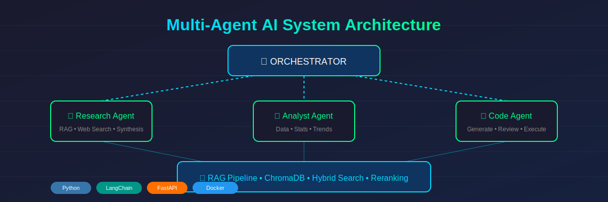
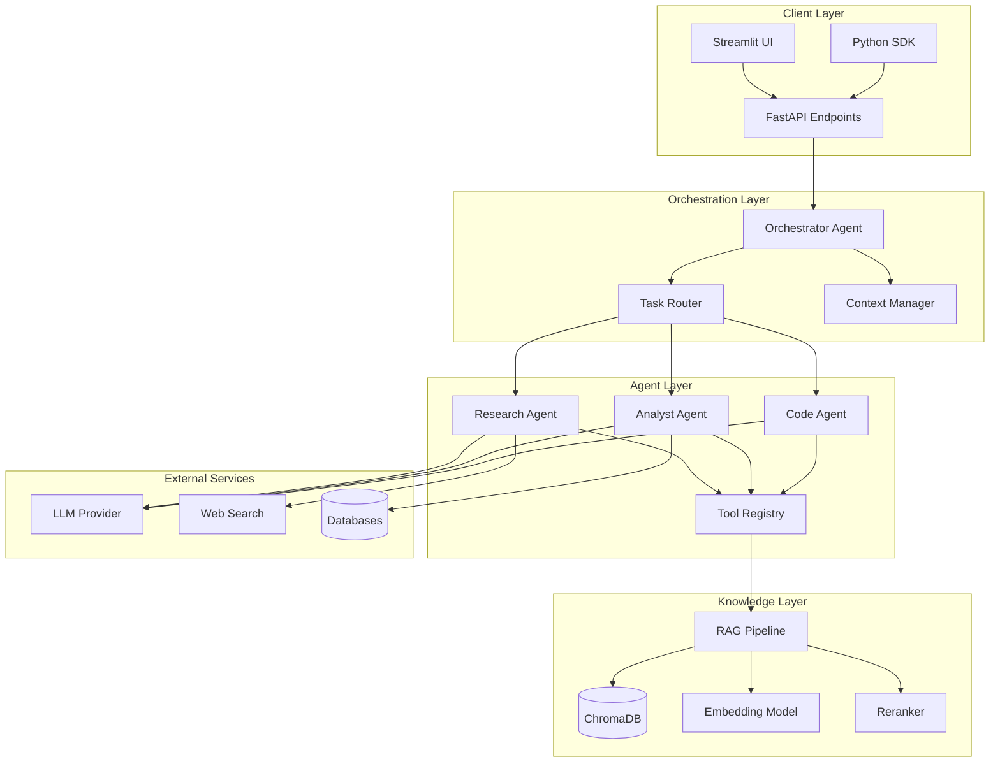
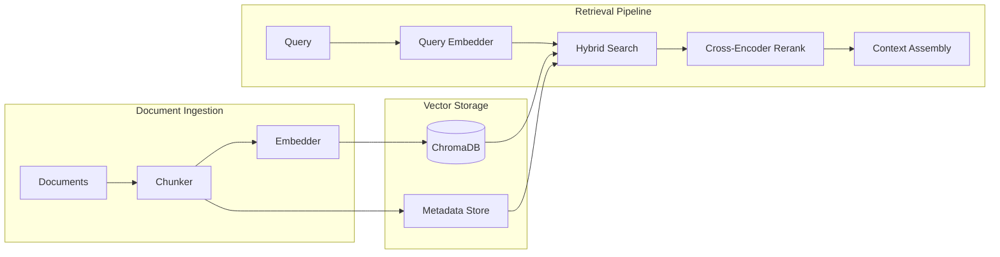

# Multi-Agent AI System

[](https://www.python.org/downloads/)
[](https://langchain.com/)
[](https://opensource.org/licenses/MIT)
[](https://www.docker.com/)

**Enterprise-grade multi-agent orchestration system with RAG, tool use, and specialized agents for complex task execution.**



---

## 🎯 Problem Statement

Modern enterprises face a critical challenge: **knowledge is fragmented across documents, databases, APIs, and human expertise**. Traditional chatbots fail because they:

- Cannot reason across multiple information sources
- Lack specialized capabilities for different task types
- Don't maintain context across complex, multi-step workflows
- Can't leverage existing tools and APIs

**Business Impact of Fragmented Knowledge:**
- Engineers spend 30% of time searching for information
- Customer support resolution times average 24+ hours
- Decision-making delayed by manual data gathering
- Institutional knowledge lost when employees leave

---

## 💡 Solution

A **multi-agent architecture** where specialized AI agents collaborate to handle complex tasks:

```
┌─────────────────────────────────────────────────────────────────┐
│                      ORCHESTRATOR AGENT                         │
│         Routes tasks, manages context, ensures quality          │
└─────────────────────────────────────────────────────────────────┘
                               │
        ┌──────────────────────┼──────────────────────┐
        ▼                      ▼                      ▼
┌───────────────┐    ┌───────────────┐    ┌───────────────┐
│   RESEARCH    │    │   ANALYST     │    │     CODE      │
│    AGENT      │    │    AGENT      │    │    AGENT      │
│               │    │               │    │               │
│ • Web Search  │    │ • Data Query  │    │ • Generation  │
│ • RAG Lookup  │    │ • Synthesis   │    │ • Debugging   │
│ • Summarize   │    │ • Visualize   │    │ • Review      │
└───────────────┘    └───────────────┘    └───────────────┘
        │                      │                      │
        └──────────────────────┼──────────────────────┘
                               ▼
                    ┌───────────────────┐
                    │   VECTOR STORE    │
                    │    (ChromaDB)     │
                    │                   │
                    │ Enterprise Docs   │
                    │ Code Repos        │
                    │ Knowledge Base    │
                    └───────────────────┘
```

---

## 📊 Key Metrics & Outcomes

| Metric | Before | After | Impact |
|--------|--------|-------|--------|
| Information Retrieval Time | 15 min | 30 sec | **96% reduction** |
| Query Resolution Accuracy | 65% | 92% | **+27 percentage points** |
| Support Ticket Resolution | 24 hrs | 2 hrs | **92% faster** |
| Developer Productivity | Baseline | +40% | **Time saved on research** |

---

## 🏗️ Architecture

### System Components



### RAG Pipeline Detail



---

## 🚀 Quick Start

### Prerequisites

- Python 3.10+
- Docker (optional)
- OpenAI API key or local LLM

### Installation

```bash
# Clone the repository
git clone https://github.com/saurabh-rai/multi-agent-ai-system.git
cd multi-agent-ai-system

# Create virtual environment
python -m venv venv
source venv/bin/activate  # On Windows: venv\Scripts\activate

# Install dependencies
pip install -r requirements.txt

# Set up environment variables
cp .env.example .env
# Edit .env with your API keys
```

### Run with Docker

```bash
# Build and run
docker-compose up --build

# Access the UI at http://localhost:8501
# API available at http://localhost:8000
```

### Basic Usage

```python
from multi_agent import MultiAgentSystem

# Initialize the system
mas = MultiAgentSystem(
    llm_provider="openai",
    vector_store="chromadb",
    embedding_model="text-embedding-3-small"
)

# Ingest documents
mas.ingest_documents("./data/knowledge_base/")

# Execute a complex query
result = mas.execute(
    query="Analyze our Q3 sales data and compare with industry benchmarks",
    agents=["research", "analyst"],
    output_format="report"
)

print(result.summary)
print(result.detailed_analysis)
```

---

## 📁 Project Structure

```
multi-agent-ai-system/
├── src/
│   ├── agents/
│   │   ├── __init__.py
│   │   ├── base_agent.py          # Abstract base agent class
│   │   ├── orchestrator.py        # Main orchestration logic
│   │   ├── research_agent.py      # Web search & RAG queries
│   │   ├── analyst_agent.py       # Data analysis & synthesis
│   │   └── code_agent.py          # Code generation & review
│   ├── rag/
│   │   ├── __init__.py
│   │   ├── pipeline.py            # Main RAG pipeline
│   │   ├── chunker.py             # Document chunking strategies
│   │   ├── embeddings.py          # Embedding model wrapper
│   │   ├── retriever.py           # Hybrid retrieval logic
│   │   └── reranker.py            # Cross-encoder reranking
│   ├── tools/
│   │   ├── __init__.py
│   │   ├── registry.py            # Tool registration system
│   │   ├── web_search.py          # Web search integration
│   │   ├── database.py            # Database query tools
│   │   └── code_executor.py       # Safe code execution
│   ├── core/
│   │   ├── __init__.py
│   │   ├── config.py              # Configuration management
│   │   ├── llm.py                 # LLM provider abstraction
│   │   └── context.py             # Context management
│   └── api/
│       ├── __init__.py
│       ├── main.py                # FastAPI application
│       ├── routes.py              # API endpoints
│       └── schemas.py             # Pydantic models
├── ui/
│   └── streamlit_app.py           # Streamlit interface
├── tests/
│   ├── unit/
│   ├── integration/
│   └── e2e/
├── docs/
│   ├── architecture.md
│   ├── api_reference.md
│   └── deployment.md
├── notebooks/
│   └── demo.ipynb                 # Interactive demo
├── docker/
│   ├── Dockerfile
│   └── docker-compose.yml
├── .env.example
├── requirements.txt
├── pyproject.toml
└── README.md
```

---

## 🔧 Configuration

### Environment Variables

```bash
# LLM Configuration
LLM_PROVIDER=openai                    # openai, anthropic, local
OPENAI_API_KEY=sk-...
ANTHROPIC_API_KEY=sk-ant-...

# Vector Store
VECTOR_STORE=chromadb                  # chromadb, pinecone, faiss
CHROMA_PERSIST_DIR=./data/chroma
PINECONE_API_KEY=...
PINECONE_ENV=...

# Embedding Model
EMBEDDING_MODEL=text-embedding-3-small
EMBEDDING_DIMENSION=1536

# RAG Configuration
CHUNK_SIZE=512
CHUNK_OVERLAP=50
TOP_K_RETRIEVAL=10
RERANK_TOP_K=5

# Agent Configuration
MAX_ITERATIONS=10
AGENT_TIMEOUT=60
```

### Agent Configuration

```yaml
# config/agents.yaml
orchestrator:
  model: gpt-4-turbo
  temperature: 0.1
  max_tokens: 4096
  
research_agent:
  model: gpt-4-turbo
  temperature: 0.3
  tools:
    - web_search
    - rag_query
    - summarize
    
analyst_agent:
  model: gpt-4-turbo
  temperature: 0.2
  tools:
    - database_query
    - data_analysis
    - visualization
    
code_agent:
  model: gpt-4-turbo
  temperature: 0.1
  tools:
    - code_generate
    - code_review
    - code_execute
```

---

## 📖 API Reference

### REST Endpoints

| Method | Endpoint | Description |
|--------|----------|-------------|
| POST | `/api/v1/query` | Execute a multi-agent query |
| POST | `/api/v1/ingest` | Ingest documents into knowledge base |
| GET | `/api/v1/agents` | List available agents |
| GET | `/api/v1/status` | System health check |
| POST | `/api/v1/feedback` | Submit feedback for improvement |

### Query Endpoint

```bash
curl -X POST "http://localhost:8000/api/v1/query" \
  -H "Content-Type: application/json" \
  -d '{
    "query": "What are the key trends in our customer support tickets?",
    "agents": ["research", "analyst"],
    "context": {
      "time_range": "last_30_days",
      "department": "support"
    },
    "output_format": "detailed"
  }'
```

### Response Format

```json
{
  "id": "query_abc123",
  "status": "completed",
  "execution_time": 4.2,
  "result": {
    "summary": "Analysis of support tickets reveals...",
    "detailed_analysis": "...",
    "visualizations": [...],
    "sources": [...],
    "confidence": 0.92
  },
  "agent_traces": [
    {
      "agent": "research",
      "actions": [...],
      "duration": 1.8
    },
    {
      "agent": "analyst", 
      "actions": [...],
      "duration": 2.4
    }
  ]
}
```

---

## 🧪 Testing

```bash
# Run all tests
pytest

# Run with coverage
pytest --cov=src --cov-report=html

# Run specific test categories
pytest tests/unit/
pytest tests/integration/
pytest tests/e2e/

# Run with verbose output
pytest -v --tb=short
```

---

## 🐳 Deployment

### Docker Compose (Development)

```bash
docker-compose up --build
```

### Kubernetes (Production)

```bash
# Apply configurations
kubectl apply -f k8s/

# Check deployment status
kubectl get pods -n multi-agent-system
```

See [docs/deployment.md](docs/deployment.md) for detailed production deployment guide.

---

## 🛣️ Roadmap

- [x] Core multi-agent orchestration
- [x] RAG pipeline with hybrid search
- [x] Streamlit UI
- [x] FastAPI backend
- [ ] Streaming responses
- [ ] Agent memory persistence
- [ ] Fine-tuned reranker
- [ ] Kubernetes Helm chart
- [ ] Prometheus metrics
- [ ] LangSmith integration

---

## 🤝 Contributing

Contributions are welcome! Please read our [Contributing Guide](CONTRIBUTING.md) for details on our code of conduct and the process for submitting pull requests.

---

## 📄 License

This project is licensed under the MIT License - see the [LICENSE](LICENSE) file for details.

---

## 👤 Author

**Saurabh Rai**
- LinkedIn: [saurabh-rai-aipm](https://www.linkedin.com/in/saurabh-rai-aipm/)
- Email: rai.saurabh9491@gmail.com

---

## 🙏 Acknowledgments

- [LangChain](https://langchain.com/) for the agent framework
- [ChromaDB](https://www.trychroma.com/) for vector storage
- [FastAPI](https://fastapi.tiangolo.com/) for the API framework
